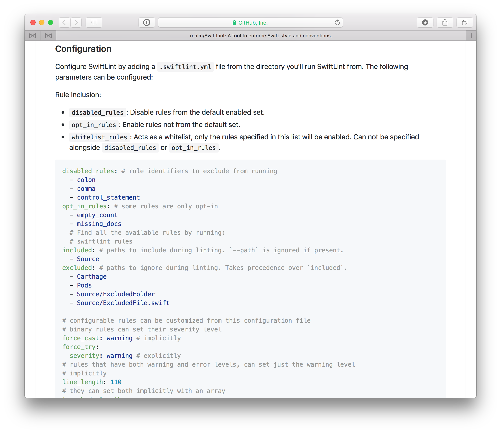

theme: Plain Jane, 1

# Linters

---


---

* Derived from the Portble C Compiler (PCC)
* Unix V7 in 1979
* Named after "the undesirable bits of fiber and fluff found in sheep's wool."

---


---

  
  
 

---


---


---


---


---



---


---


---

# Go forth and lint!

```
$ swiftlint
Done linting! Found 0 violations, 0 serious in 8 files.
```

---

# Image Credits

* ["Lamb Lint"](https://explore.468photography.com/2012/04/17/lamb-lint/) By 468photography
* ["Adams' Illustrated Panorama of History"](https://commons.wikimedia.org/wiki/File%3A1878_Adams_Monumental_Illustrated_Panorama_of_History_-_Geographicus_-_WorldHistory-adams-1871.jpg) By Creator:Sebastian C. Adams [Public domain], via Wikimedia Commons
* ["Ruby Logo"](https://commons.wikimedia.org/wiki/File%3ARuby_logo.svg) By Yukihiro Matsumoto, Ruby Visual Identity Team (https://www.ruby-lang.org/en/about/logo/) [CC BY-SA 2.5 (http://creativecommons.org/licenses/by-sa/2.5)], via Wikimedia Commons
* ["Clojure Logo"](https://commons.wikimedia.org/wiki/File%3AClojure_logo.svg) By Tom Hickey and Rich Hickey (File:Clojure-icon.png) [Public domain], via Wikimedia Commons

---
* [.NET Logo"](https://commons.wikimedia.org/wiki/File%3AMicrosoft_.NET_logo.png) By Microsoft (https://www.microsoft.com/net) [Public domain], via Wikimedia Commons
* ["Swift Logo"](https://commons.wikimedia.org/wiki/File%3ASwift_logo.svg) See page for author [Public domain], via Wikimedia Commons
* ["Java Logo"](https://commons.wikimedia.org/wiki/File%3ADuke_(Java_mascot)_waving.svg) By sbmehta converted to SVG from Sun Microsystems AI version. [BSD (http://opensource.org/licenses/bsd-license.php)], via Wikimedia Commons
* ["Go Logo"](https://commons.wikimedia.org/wiki/File%3AGopher-ru.png) By Renee French (https://blog.golang.org/gopher) [CC BY 3.0 (http://creativecommons.org/licenses/by/3.0)], via Wikimedia Commons

---

* ["Python Logo"](https://www.python.org/community/logos/)
* ["JavaScript Logo"](https://commons.wikimedia.org/wiki/File%3AJavaScript-logo.png) By Ramaksoud2000 via Chris Williams (Wikipedia via GitHub logo.js) [Public domain], via Wikimedia Commons
* ["ReSharper Inspection Results"](https://www.jetbrains.com/resharper/features/code_analysis.html)
* ["SwiftLint example"](https://github.com/realm/SwiftLint)

---

* ["Take My Advice Pin"](https://www.flickr.com/photos/jdhancock/3553699652/in/photostream/) By JD Hancock [CC BY-SA 4.0 (https://creativecommons.org/licenses/by/2.0)]
* ["The Cult of the Quiet Car"](http://www.chicagomag.com/Chicago-Magazine/September-2016/Metra-Quiet-Car/)
* ["You Shall Not Pass"](http://www.deviantart.com/art/You-Shall-Not-Pass-330127651) by entroz
* ["Low hanging fruit (grapes)"](https://commons.wikimedia.org/wiki/File%3ALow_hanging_fruit_(grapes).jpg) By andreas_fischler (Low Hanging Fruits) [CC BY 2.0 (http://creativecommons.org/licenses/by/2.0)], via Wikimedia Commons
